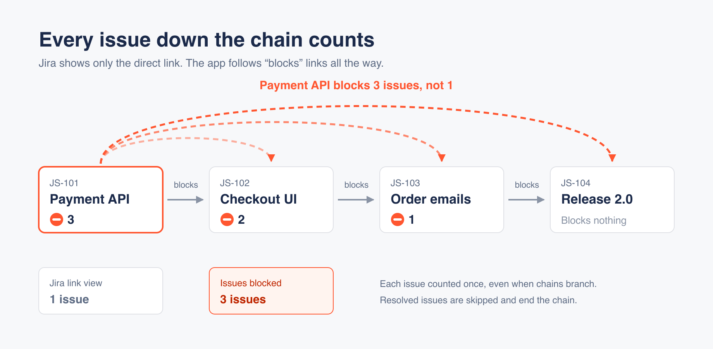

# Blocker Counter documentation

Blocker Counter adds a read-only **Issues blocked** field to every Jira Cloud issue. It shows how
many unresolved issues the issue blocks, directly or through a chain of "blocks" links, so you can
see which work unblocks the most other work.

- [What the count means](#what-the-count-means)
- [Show the count on backlog cards](#show-the-count-on-backlog-cards)
- [Filter and sort with JQL](#filter-and-sort-with-jql)
- [How counts stay up to date](#how-counts-stay-up-to-date)
- [Recalculate all counts](#recalculate-all-counts)
- [FAQ](#faq)
- [Support](#support)

## What the count means

The count is the number of **unique, unresolved** issues you reach by following "blocks" links
outward from an issue, to any depth.



If A blocks B, B blocks C and C blocks D:

| Issue | Blocks, directly or through the chain | Issues blocked |
|---|---|---|
| A | B, C, D | 3 |
| B | C, D | 2 |
| C | D | 1 |
| D | nothing | *(empty)* |

The counting rules:

- **Only the "Blocks" link type counts.** Links such as *relates to*, *duplicates* and *clones*, and
  custom link types, are ignored. Parent/child and sub-task relationships are not blocking links.
- **Each issue is counted once.** If A blocks both B and C, and both of them block D, A's count is 3
  (B, C and D), not 4.
- **Resolved issues are not counted, and the chain stops there.** A resolved issue no longer blocks
  anything. With A → B → C (Done) → D, A's count is 1.
- **Circular links are handled safely.** If A blocks B and B blocks A, both show 1. An issue is never
  counted in its own total.
- **Links across projects count**, and every issue type takes part.
- **A count of 0 is shown as empty**, so only issues that block something stand out.

## Show the count on backlog cards

On **company-managed** boards, add the field to your backlog cards once per board:

1. Open the board and go to **Board settings** → **Card layout**.
2. Under **Backlog**, choose **Issues blocked** and click **Add**.

Every backlog card now shows its count, for example "⛔ 3". Hover over it to see the field name.
You need permission to administer the board to change its card layout.

Backlog cards on team-managed boards aren't supported yet. The field still works in the issue view
and in JQL on every project.

## Filter and sort with JQL

**Issues blocked** is a number field, so you can use it in any JQL search, filter or dashboard
gadget.

Issues that block anything, biggest blockers first:

```
"Issues blocked" > 0 ORDER BY "Issues blocked" DESC, priority DESC
```

Issues that block at least 5 others in one project:

```
project = ABC AND "Issues blocked" >= 5
```

## How counts stay up to date

Counts update automatically, usually within a minute, when:

- a "blocks" link is added or removed,
- an issue is resolved or reopened, or
- an issue is deleted.

A change updates every issue further up the chain. For example, if D starts blocking E, the counts
of A, B, C and D all go up by one.

When you install the app, it counts all existing links once in the background. On large sites this
can take a few minutes.

## Recalculate all counts

If counts ever look wrong, for example after a Jira incident, you can rebuild them all:

1. Go to **Jira settings** (⚙) → **Apps**.
2. In the sidebar, open **Blocker Counter**.
3. Click **Recalculate all**.

The recalculation runs in the background. Only Jira administrators can open this page.

## FAQ

**Why is the field empty on an issue?**
The issue doesn't block any unresolved issue, so its count is 0 and shown as empty. Check that its
links use the "Blocks" link type and that the issues it blocks aren't already resolved.

**Why didn't a count change straight away?**
Updates usually take under a minute. If a count is still wrong after a few minutes, use
[Recalculate all](#recalculate-all-counts).

**Can I edit the field?**
No. The app calculates it, so it is read-only.

**Is there a limit?**
To keep calculations fast, the app stops counting at 500 issues. An issue that blocks more than 500
issues shows 500.

**Can I count other link types?**
Not yet. Only the built-in "Blocks" link type is counted.

**Does the app send my data anywhere?**
No. The app runs entirely on Atlassian's cloud and never sends data outside it. See the
[Privacy Policy](privacy-policy).

## Support

Found a problem or have a question? Open an issue at
[github.com/jvalatkevicius/blocker-counter-site/issues](https://github.com/jvalatkevicius/blocker-counter-site/issues).
